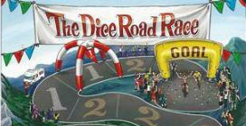

## 『The Dice Road Race(ダイスロードレース)』

### 概要

『ダイスロードレース』は自転車ロードレースの山頂ゴールステージをテーマにしたすごろくゲームです。  

プレイヤーは選手となり、ライバルよりも早くゴールすることを目指します。  
各プレイヤーは3個のダイス(D6)を持ってスタートします。  
手番プレイヤーは手持ちのダイスから任意の個数(1~3)を選んで振ります。手番プレイヤーと同じマスにいるプレイヤーも同じ個数を持っていればダイスを振ることができます。  
「6」の目が出ると一気に進むことができますが、ダイスを失ってしまいます。最低1個は戻ってくるルールなので、常に1個振り続ける限りダイスを失う危険はありません。  

ナイロ・キンタナのように鮮やかなアタックを決めるか？それとも、クリス・フルームのようにマイペースでライバルを追い詰めるのか？  
ルールはシンプルですが、ロードレースのリアルな駆け引きを楽しめるゲームです。  

### 製品情報

**※ このゲームは[ゲームストア・バネスト様のセール](http://banesto-telegraph.blogspot.jp/2016/07/gamestore-banesto-telegraph-2016-07-02.html)にて配布されたものであり、現在は入手できません。ご了承ください。**

* プレイ人数：2～4人
* プレイ時間：約10分
* 対象年齢：8才以上

ゲームデザイン：[fullkawa](https://twitter.com/fullkawa)  
イラスト：Haruka Yamashiro

