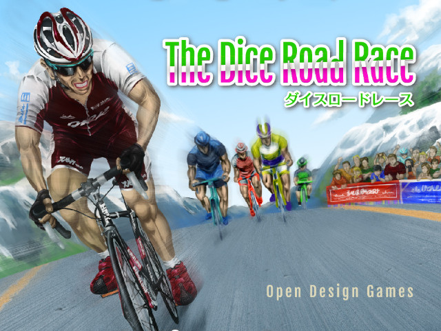

## 『The Dice Road Race(ダイスロードレース)』 ステージレースルール

### 概要

これは、『The Dice Road Race(ダイスロードレース)』をステージレースゲームとして楽しむための追加ルールです。  
既存ルールは製品版説明書にてご確認ください。既存ルールと相容れない場合は本ルールを優先します。  

### 必要なもの

このゲームを楽しむためには[『The Dice Road Race(ダイスロードレース)』製品版](http://gamemarket.jp/game/the-dice-road-race%E3%83%80%E3%82%A4%E3%82%B9%E3%83%AD%E3%83%BC%E3%83%89%E3%83%AC%E3%83%BC%E3%82%B9/)＋追加コマ・ダイスセット(※推奨)が必要です。  
また、順位計算／表示のため、ホワイトボード等を用意することをオススメします。  

### ゲームの目的(勝利条件)

プレイヤーは複数のステージで勝負を行います。ステージの結果によって総合時間が変動します。  
ゲーム終了時点で総合時間が **少ない順** に順位を決定し、1位のプレイヤーを勝者(＝総合優勝)とします。
総合時間が等しいプレイヤーが複数いる場合は最終ステージのゴールが早い順に順位を付けます。  

### ゲーム終了条件

すべてのステージが終了したとき。  
または全ステージ終了を待たずに順位が確定し、全プレイヤーがゲーム終了に同意したとき。[協議終了]  

### ゲームの準備

[別表『ステージレース コースレイアウト』](#course_layout)を参考に、ステージごとにボードを組み替えます。  

第1ステージが始まる前に、プレイヤーは好きな色のコマとダイスを選択することができますが、プレイ人数が5名以下の時は
後述する[『選択ルール1.リーダーカラー』](#variant1)を採用することができます。  

### ステージ終了

最初にゴール(＝ステージ優勝)したプレイヤーを起点に、追加で1ラウンド行います。  
1ラウンドとは手番プレイヤーが時計回りに一周することを言います。  

このルールに従った結果、最終ステージ終了後の総合時間が等しいプレイヤーが複数いる場合は彼(彼女)らのゴール順位が
確定するまでゲームを継続します。  

### ステージの順位とボーナスタイム、追加タイム

ステージ優勝者と同時にゴールしたプレイヤーに追加タイムはありません。  
追加の1ラウンド内にゴールできたプレイヤーは10秒、ゴールできなかったプレイヤーは20秒を追加タイムとして受け取り、
自分の総合時間に加えます。  

また、毎ステージ(個人TTステージをのぞく)、ゴールした順位に応じて以下のボーナスタイムを獲得します。

| 1位 | 2位 | 3位 |
| --- | --- | --- |
| 10秒 | 5秒 | 2秒 |

同時にゴールしたプレイヤーが複数いる場合は手番プレイヤーから時計回りに順位が付きます。  
追加ラウンド内にゴールできなかったプレイヤーは順位が付かない扱いとなり、例えゴール済みのプレイヤーが3名以下でもボーナスタイムを獲得することはできません。  

ボーナスタイムを獲得したプレイヤーは自分の総合時間からその分を引きます。総合時間はマイナスの値になっても問題ありません。  

> 例1.第1ステージにてプレイヤー1(手番プレイヤー)とプレイヤー3が同時にゴールした場合   
>  -> プレイヤー1がステージ1位で10秒のボーナスタイムを獲得し、総合時間は-10秒となります。  
>     プレイヤー3はステージ2位で5秒のボーナスタイムを獲得し、総合時間は-5秒となります。  
> 
> 例2.例1の直後、追加ラウンド内にプレイヤー2がゴールした場合  
>  -> プレイヤー2は追加タイムが10秒。ステージ3位によるボーナスタイムを2秒を獲得し、総合時間は10-2=8秒となります。  
> 
> 例3.例2の後、追加ラウンド内にプレイヤー4がゴールできなかった場合  
>  -> プレイヤー4は追加タイム20秒がそのまま総合時間となります。  
> 
> 例4.第2ステージにてプレイヤー2が単独1位でゴールし、その他のプレイヤーが誰も追加ラウンド内にゴールできなかった場合  
>  -> プレイヤー2の総合時間は8-10=-2秒となります。プレイヤー1,3,4はいずれも+20秒(ボーナスタイムなし)なので
> 総合時間はそれぞれ、-10+20=10秒, -5+20=15秒, 20+20=40秒となります。  

### 総合順位と時間差

ステージが終了したら、その時点での時間差を計算し、総合順位を出します。  

> 上記例1～3(第1ステージ)での総合順位と時間差
> 
> | 総合順位 | プレイヤー名 | 総合時間 | 時間差 |
> | --- | --- | --- | --- |
> | 1位 | プレイヤー1 | -10秒 | - |
> | 2位 | プレイヤー3 | -5秒 | +5秒 |
> | 3位 | プレイヤー2 | 8秒 | +18秒 |
> | 4位 | プレイヤー4 | 20秒 | +30秒 |
> 
> 上記例4(第2ステージ)での総合順位と時間差
> 
> | 総合順位 | プレイヤー名 | 総合時間 | 時間差 |
> | --- | --- | --- | --- |
> | 1位 | プレイヤー2 | -2秒 | - |
> | 2位 | プレイヤー1 | 10秒 | +12秒 |
> | 3位 | プレイヤー3 | 15秒 | +17秒 |
> | 4位 | プレイヤー4 | 40秒 | +42秒 |

### 回復

すべてのプレイヤーは次のステージが始まる前にゲームから除外されたダイスを1個取り戻すことができます。  
ただし、4個以上に増やすことはできません。取り戻す権利を次のステージへ持ち越すこともできません。  

### リタイア

時間差が大きくなりすぎて総合順位争いに興味がなくなったプレイヤーはゲーム中いつでも「リタイア」を宣言することが出来ます。  
リタイアを宣言したプレイヤーは **総合時間そのもの** を失い、以後総合順位・時間差計算の対象外となります。  
もしステージの途中であれば、即座に自分のコマをボード上から取り除きます。  

リタイアを宣言したプレイヤーは次のステージからダイス3個を持ってプレイに復帰します。彼(彼女)のプレイの目的はステージ優勝のみになるでしょう。  
1～3位でゴールすればボーナスタイムを獲得しますが、それが何かの役に立つことはありません。ただ、他のプレイヤーがボーナスを獲得できなくなるだけです。  

同じプレイヤーが複数回リタイアを宣言することも可能です。  

### タイムトライアルステージ

コースレイアウトに「個人TT」と書かれているステージはタイムトライアルステージとなり、以下の特別なルールでプレイします。

#### 制約

タイムトライアルステージでは、他のプレイヤーがいるマスに止まることはできません。手前で止まったり追い越すのは問題ありません。  
よって、プレイヤーは自分の手番でしか進むことができません。  

#### プレイの順番

タイムトライアルステージでは時計回りではなく、総合順位が下位のプレイヤーから順にプレイします。
すでにリタイアしたプレイヤーは最下位のプレイヤーよりも先にプレイします。複数いる場合は先にリタイアした方が先となります。  

また、スタートは1ラウンドおきに行います。  

> 例5.上記例4(第2ステージ)の後の場合  
>  第1ラウンド: プレイヤー4(スタート)  
>  第2ラウンド: プレイヤー4  
>  第3ラウンド: プレイヤー4 -> プレイヤー3(スタート)  
>  第4ラウンド: プレイヤー4 -> プレイヤー3  
>  第5ラウンド: プレイヤー4 -> プレイヤー3 -> プレイヤー1(スタート)  
>  (以下省略)  

#### ステージの順位とボーナスタイム、追加タイム

各プレイヤーは自分がダイスを振った回数(個数ではありません)を記録しておきます。  
タイムトライアルステージではボードが2枚しかありませんが、コースを走り抜けたところがゴールです。
以下の計算式で追加タイムを計算し、最も少なかったプレイヤーがステージ優勝となります。  

追加タイム = ゴールするまでにダイスを振った回数×10 - 余った出目

> 例6.残りコスト4の位置で5回目に出目7を出してゴールした場合  
>  -> 5×10 - (7 - 4) = 50 - 3 = 47秒

タイムトライアルステージにボーナスタイムはありません。  
総合時間への追加タイム加算は他ステージと同様に行います。  

### 選択ルール1.リーダーカラー

黄あるいはピンクは自転車ロードレースファンにはおなじみの色です。  
これらは「リーダーカラー」と呼ばれ、ステージ開始時点で総合1位にいる選手がその色のジャージを着て走ります。  

これを再現するため、プレイ人数が5名以下の場合はゲーム開始時にあえてリーダーカラーを選択せず、残しておきます。  
そしてステージが終わり、その時点での暫定総合順位が1位であるプレイヤーが次のステージでリーダーカラーのコマ、ダイスで
プレイします。このとき、利用可能なダイスの個数は維持するものとします。  
その後、総合順位1位から陥落した場合は元のカラーに戻し、新たに1位となったプレイヤーが代わりにリーダーカラーを使用します。  

### ステージレース コースレイアウト

|  | ボード1 | ボード2 | ボード3 | コスト合計 | 特殊ルールなど |
| --- | --- | --- | --- | --- | --- |
| 第1ステージ[平坦] | 2(黒) | 1(白) | 3(白) | 45 |  |
| 第2ステージ[山岳] | 1(黒) | 2(黒) | 3(黒) | 48 |  |
| 第3ステージ[個人TT] | 1(白) | 2(黒) | --- | 28 | ボーナスタイムなし |
| 第4ステージ[中級山岳] | 1(白) | 2(白) | 3(白) | 47 |  |
| 第5ステージ[山岳] | 2(白) | 1(黒) | 3(黒) | 50 | 順位が確定するまでゲームを継続する |

※カッコ内の色はボードの右下に描かれたボード番号の数字の色を示します。

追加ルールデザイン：[fullkawa](https://twitter.com/fullkawa)  
