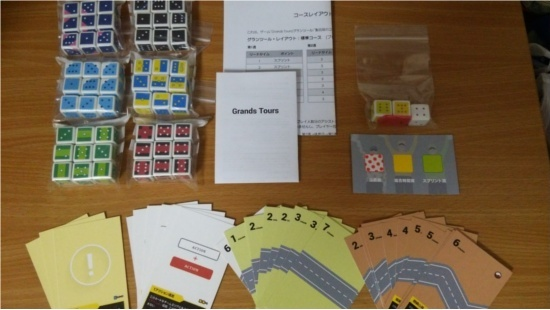

## オリジナルボードゲーム『Grands-Tours(グランツール)』

### 概要

『Grands-Tours(グランツール)』は自転車ロードレース、とりわけツール・ド・フランスに代表される“ステージレース”をテーマにしたゲームです。  
プレイヤーは自転車チームの監督となり、選手(ダイス)をうまくやりくりして、栄誉ある三賞ジャージの獲得を目指して下さい。  

### どんなゲームなの？

基本となるゲームメカニクスは“競り”です。  
プレイヤーは狙っているステージカードにダイスを置いていきます。その出目の合計が一番大きいプレイヤーがカードを競り落とします。  

もちろん、プレイヤーの目的はステージに勝つことではありません。  
ステージを勝つことによって得られるリードタイムあるいは山岳/スプリントポイントを集め、最終的に「個人時間賞」「スプリント賞」「山岳賞」いずれかのジャージを獲得したプレイヤーがゲームの勝者となります。  

プレイヤーが自分の手番で実行できるのは以下の中から１アクションだけです。  
* 【配置】アクション：ダイスを１つ置きます。  
* 【置換】アクション：２つのダイスで別の(主に他プレイヤーの)１つを置き換えます。  
* 【トレイン】アクション：連番で３つのダイスを置きます。  
* 【ロール】アクション：使用し終わったダイスを回収します。  
* 【パス】アクション：手番をパスします。  

ポイントは「現在競りの対象になっているカード“以外”のカードにもダイスを置くことができる」点です。  
そのため「運(ダイスの出目)」よりも、「誰がどのカードを狙っているか？そのカードを渡しても大丈夫なのか？等を判断する力」「必要なときに必要な出目が残るようにマネジメントする力」だったりします。  

詳しいルールは以下のマニュアルをご覧ください。  
[Grands-Tours マニュアル](grands_tours_manual.pdf)  

標準コース(プレイ時間:約90分)とショートコース(プレイ時間:約30分)があります。コースレイアウトは下記をご覧ください。  
[Grands-Tours コースレイアウトシート](gt_course_layouts_product.pdf)  

### 製品情報

* プレイ人数：4～6人
* プレイ時間：約30～90分(コースによる)
* 対象年齢：10才以上

ゲームデザイン：[fullkawa](https://twitter.com/fullkawa)  
アートデザイン：new1ro  
