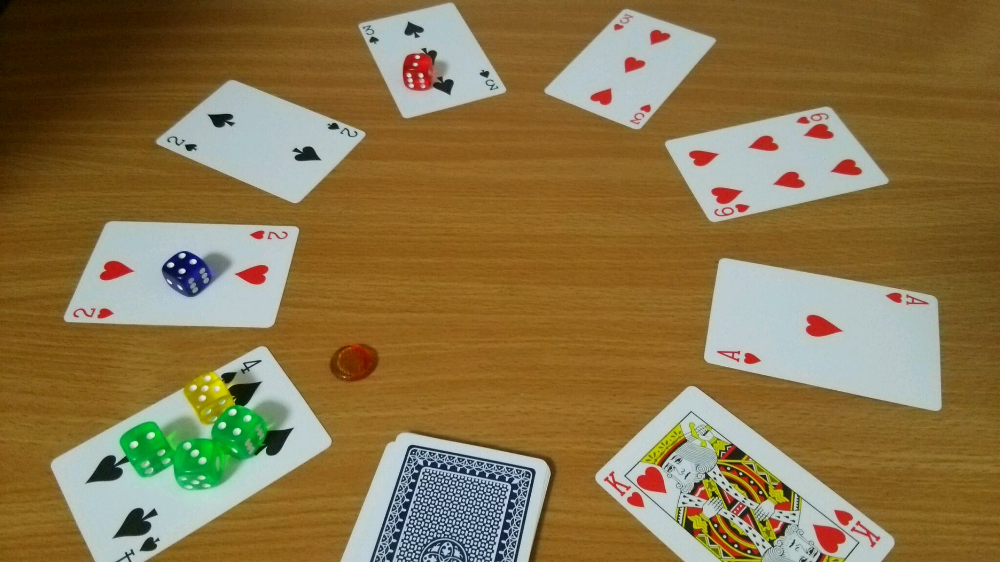

## オリジナルボードゲーム『Grands-Tours(グランツール)』

### 概要

『Grands-Tours(グランツール)』は自転車ロードレース、とりわけツール・ド・フランスに代表される“ステージレース”をテーマにしたゲームです。  
プレイヤーは自転車チームの監督となり、選手(ダイス)をうまくやりくりして、栄誉ある三賞ジャージの獲得を目指して下さい。  

ゲームの詳細は下記ページをご覧ください。  
[http://fullkawa.github.io/open-design-games/products/grands_tours.html](http://fullkawa.github.io/open-design-games/products/grands_tours.html)

これは『Grands-Tours(グランツール)』コンポーネントフリー版のページです。

### コンポーネントフリー版とは

ゲームオリジナルのコンポーネント(カード、ダイスなど)を使わなくても遊べるようにアレンジしたルールです。  
遊ぶためには、トランプとダイス(プレイ人数×９コ)他を自分で用意する必要があります。  
ルール他は下記リンク先から無料でダウンロードすることが出来ます。  

### ダウンロード

[Grands-Tours マニュアル(コンポーネントフリー版)](https://dl.dropboxusercontent.com/u/23857672/grands-tours/grands_tours_manual_free.pdf)

[Grands-Tours コースレイアウトシート(コンポーネントフリー版)](http://fullkawa.github.io/open-design-games/products/gt_course_layouts_free.pdf)

ゲームデザイン：[fullkawa](https://twitter.com/fullkawa)  
