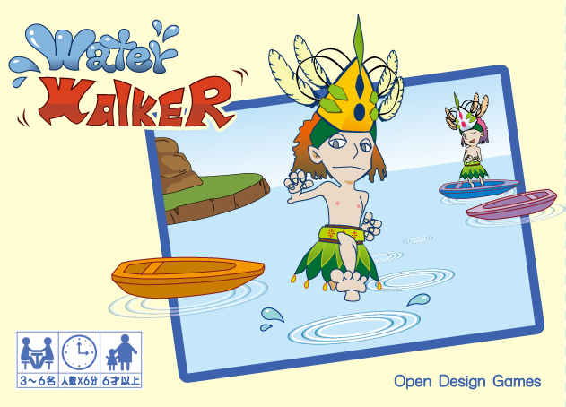
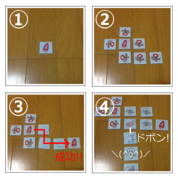

## オリジナルボードゲーム『Water Walker』

『Water Walker』は誰が一番長く水の上を歩けたかを競うゲームです。

### 概要

プレイヤーは、水の上を歩く『洋行術』というワザを身につけた若者となり、水上を走り抜けます。走った距離(めくったパネルの枚数)が多いほど高得点が得られます。

しかし、油断は禁物。ライバルたちが『ドボン』の呪いをかけた水面を踏んでしまうと、そのまま水中へ一直線！トライ失敗となり、得点は得られません。

プレイヤーの読みと記憶力がタメされるゲームでもあります。

### 『Water Walker』はこんなゲーム！

① スタート地点まで舟を出す  
② 水面をよく見極めて… (他プレイヤーが水面パネルを配置します)  
③ ゴール地点の舟まで渡りきれば成功！  
④ しかし、いつも上手く行くとは限らない…！  

下記マニュアルにて、遊び方・詳細なルールを確認できます。  
[WaterWalkerマニュアル](water_walker_manual.pdf)  

### 製品情報

* プレイ人数：3 ～ 6 人
* プレイ時間：プレイ人数× 6 分
* 対象年齢：6 才以上

ゲームデザイン：[fullkawa](https://twitter.com/fullkawa)  
イラスト、パネルデザイン：[謙治](https://twitter.com/im_kenji)  
