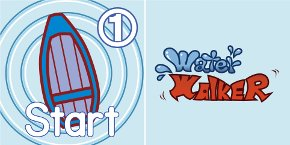
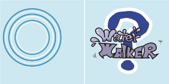
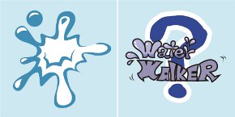

# Water Walker Player's Guide

## TABLE OF CONTENTS

1. OVERVIEW  
2. CONTENTS  
3. HOW TO PLAY  
 3.1. SETUP  
 3.2. WHAT SHOULD I DO?  
 3.3. FLOW AND RULES  
 3.4. END OF THE GAME  
4. VARIANT RULES  

## 1. OVERVIEW

"Water Walker" is a game that compete for longest walking on the water.  

In the south of a fictional island, people can use a trick called "Water Walking". And the master of "Water Walking" is respected as master of fishing from everyone.  
Come on, let's prove that you are the best of the masters !  

* Players: 3-6 people  
* Playing Time: Players x 6 minutes  
* Age: 6 years and older  

Game Design: fullkawa (Twitter:@fullkawa)  
Art Design: Kenji (Twitter:@im_kenji)  

## 2. CONTENTS

* "Boat(Start)" panels; 1 piece x 6 colors  
 recto | verso  

* "Boat(Goal1)", "Boat(Goal2)" panels; each 1 piece x 6 colors  
  recto | verso  

* "Step" panels; 13 pieces x 6 colors  
 recto | verso  

* "Dobom" panels; 3 pieces x 6 colors  
 recto | verso  

 * "Step" and "Dobom" are called "Surface" panels, too.  

* Player's Guide (this) x 1 piece  

## 3. HOW TO PLAY

### 3.1. SETUP

1. You gather all "Boat(Start)" panels face-down to the center of the table.  
2. Each player draws a "Boat(Start)" panel. If panels remained, you put them in the box. Each player looks at face of own panel. The player who draws a panel with lowest number is a start player.
3. Each player gathers their color panels; "Boat(Goal1)", "Boat(Goal2)", "Step" and "Dobom" panels.(see table 1 below)

Table 1. Number of panels in play by number of players

| Num of players | 3 | 4 | 5 | 6 |
|---|---|---|---|---|
| [1st round] |  |  |  |  |
| Num of "Step"s | 5 | 5 | 6 | 8 |
| Num of "Dobom"s | 1 | 1 | 2 | 2 |
| [2nd round] |  |  |  |  |
| Num of "Step"s | 5 | 5 | 7 | 4 |
| Num of "Dobom"s | 1 | 1 | 1 | 1 |

### 3.2. WHAT SHOULD I DO?

The turn player will challenge to get more "Step" panels than other players with no "Dobom". "Dobom" means kersplash.

Other players anticipate turn player's movement and set a trap("Dobom" panel).

### 3.3. FLOW AND RULES

All players play in flow below.

1. Deal phase
2. Start-setting phase
3. Position phase
4. Goal-setting phase
5. Moving phase
6. Scoring phase
7. End phase

The start player begin his/her turn.  
At this time he/she is the turn player.  

In 1st round, the turn player takes a round in a clockwise.  
And in 2nd round, the turn player takes a round in a counterclockwise.  

Fig 1. Turn order for 4 players  
  

* Number in the figure above is a number on the "Boat(Start)" panel.

**1st ROUND**

#### 1. Deal phase

* The turn player shuffles his/her "Surface" (i.e. "Step" + "Dobom", see table 1 above) panels face-down. Then he/she deals them to other players by the same number.

#### 2. Start-setting phase

* The turn player places a "Boat(Start)" panel face up anywhere.
 * If there are some "Surface" panels, the turn player must place a "Boat(Start" in contact with one of them.
* The turn player can place a "Boat(Start)" on any "Surface" panels.

#### 3. Position phase

* Other players place a dealt "Surface" panel face-down in a clockwise one by one until they have no panels.  
  When the players place it, they must follow the rules below.
 * When the "Boat(Start)" placed in previous phase has empty side, the players must place a "Surface" in there (i.e. up, down, left or right of "Boat(Start)").
 * The players can't place a "Surface" on other any panels.
 * The players must place a "Surface" at reachable position from the "Boat(Start)" placed in previous phase.

#### 4. Goal-setting phase

* The turn player places a "Boat(Goal1)" panel face up.
 * The turn player must place a "Boat(Goal1)" at reachable position from the "Boat(Start)" placed this start-setting phase.
 * The turn player can place a "Boat(Goal1)" on any "Surface" panels.

#### 5. Moving phase

* The turn player moves (i.e. faces a panel) in the root that he/she want from the "Boat(Start)" to the "Boat(Goal1)".
 * The turn player can move to next "Surface" or "Boat" panels placed next to each other.
 * The turn player can move on panels of any colors.
 * The turn player can't move on same panel twice.
* When the turn player faces a "Dobom" panel, this moving phase is end soon.

----

#### About "Water Walking"

The key of "Water Walking" is "step to the next before you go underwater". So the players must not slow down after their start.  
Think your root before your start and face the panels rhythmically!  

----

#### 6. Scoring phase

* If the turn player arrive to the "Boat(Goal1)", he/she gets all faced "Step" panels as his/her score and surpluses the "Boat(Goal1)".
* If the turn player draws the "Dobom" panel, he/she gets all faced "Step" panels. These panels are not the score, but these are used for tie-break.

#### 7. End phase

* The left player of the turn player becomes a next turn player (i.e. clockwise rotation).

**2nd ROUND**

The start player of 2nd round is the last turn player of 1st round.  
There are differences below with 1st round.  

#### 1. Deal phase

* The number of panels to be dealt is different. (see Table 1)

#### 2. Start-setting phase

* The turn player move a own "Boat(Start)" panel from the position placed in 1st round.

#### 3. Position phase

* There is no difference with 1st round.

#### 4. Goal-setting phase

* The turn player places a "Boat(Goal2)" panel.

#### 5. Moving phase

* There is no difference with 1st round.

#### 6. Scoring phase

* The turn player surpluses the "Boat(Goal2)" when he/she arrives.

#### 7. End phase

* The right player of the turn player becomes a next turn player (i.e. counterclockwise rotation).

### 3.4. END OF THE GAME

When the turns of all players in 2nd round is over, that is end of the game.

Count the score of all players. The player of highest score is win.  
If there are the players have same score, count the panels added them when he/she got the "Dobom".  
If there are still, they draw.  

## 4. VARIANT RULES

### "Doom-dobom"

If the turn player can't move rhythmically, other player can doom him/her and say "dobom !". When over half of the players say "dobom !", this moving phase end in a moment and the challenge of the turn player is failed.

----

If you have the questions, you can ask me via Twitter.  
[https://twitter.com/fullkawa](https://twitter.com/fullkawa)

(c) 2014 Open Design Games

