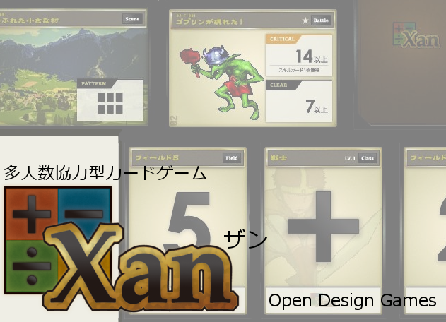

## 多人数協力型カードゲーム『Xan(ザン)』

多人数協力型カードゲーム『Xan(ザン)』はこんなゲームです。

### 基本情報

* プレイ人数: 1～4名
* プレイ時間: ～90分
* 対象年齢: 10才以上

### 多人数協力型！

* プレイヤーは一緒に冒険する仲間(パーティー)です。
* 全員で力を合わせて、次々現れる困難(モンスターとの戦闘など)を乗り越えていきましょう！

### 基本システムは「四則演算」と「推理」！

* 1～5の数字と記号(+,-,×,÷)を組み合わせて指定された条件を満たせばイベントクリア！
* 数字カードは伏せられているため、一筋縄ではいきません。それぞれのプレイヤーから出される情報を集めて推理する必要があります。

遊び方およびカードの詳細は下記リンク先ですべて公開されています。  
[fullkawa/xan - Github](https://github.com/fullkawa/dqz/tree/xan#-xan)

『Xan』はCreative Commonsライセンスで公開されています。  
よって上記公開先よりファイルを取得し、カードを自作することで無料で遊ぶことができます。

一方、イラスト付きの製品版(ページトップ画像参照)もあり、こちらはゲームマーケット等のイベントで頒布しています。

*※『Xan』は完売しました。今のところ再販の予定もありません。悪しからずご了承下さい。*
