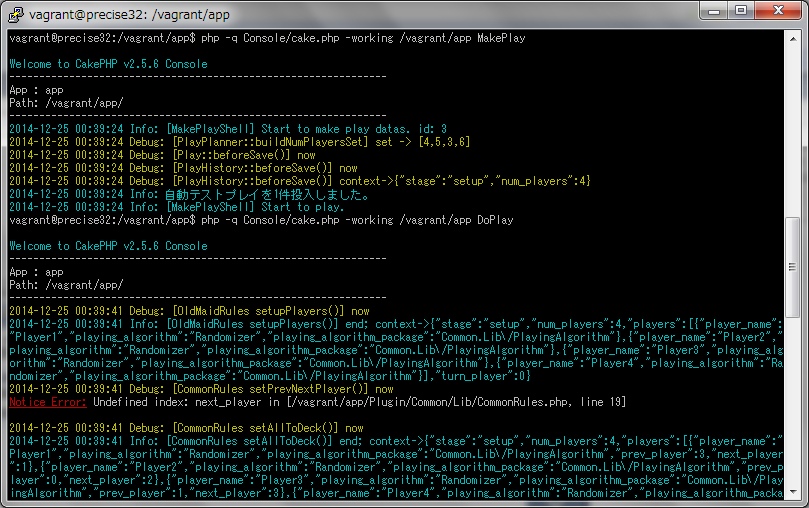

## aglab - テストプレイフレームワーク

アナログゲーム(ボードゲーム、カードゲーム等)の自動テストプレイをしたい場合、そのプログラムに求められる要件にはどんなものがあるでしょうか？

### 1.テストプレイプログラムの要件

* 要件1. ゲーム開始から終了まで人間による操作を必要としないこと。  
→試行回数を設定したら自動でその回数分のプレイデータを作成する。そのためにはもちろん、準備(例：カードを配る等)も自動で出来なければなりません。

* 要件2. 並列処理ができること。  
→今時のPCは全てマルチコアです。また、EC2等のサービスにより、個人でも必要なときに必要な分だけマシンリソースを調達できる時代です。莫大な計算量が発生するであろうテストプレイプログラムには並列処理できる仕組みが不可欠です。

* 要件3. レポートが出力できること。  
→もし1万回のテストプレイを行ったとして、その結果を順に出力するだけではゲームデザイナーは困ります。テスト結果を集計し、検証可能な状態(例：手番ごとの勝率など)にしてもらわなければなりません。

この辺りは最低限必要でしょう。  
そして、これは必須の要件ではありませんが…  

* 要件4. プリント用データが出力できること。  
→せっかくルール、コンポーネント定義がデータ化されているのなら、それらをプリントアウトして人間によるテストプレイで使いたくなります。

### 2.フレームワークとしての要件

上記で挙げたのはどちらかというと、テストしようとしているゲームに関係なく、テスト実行基盤として必要な要件と言えます。  
これらをフレームワークとして実装するなら、テストしたいゲーム独自の要素を定義する仕組みまで用意しておくのがフレームワークの責務でしょう。  

* 要件5. オリジナルゲームのルール、コンポーネントを定義できること  
→これが出来ないことにはお話になりません。

* 要件6. ルール、コンポーネント定義を使い回せること。  
要件5に加え、よくあるルール(例：デッキからカードを1枚引く等)は都度実装するのではなく、複数のゲームで使い回したいものです。それらが最初から提供されていたり、ユーザ同士で共有できたりすると素敵です。

* 要件7. 任意の検証を定義できること。  
ルールが違うのですから、当然検証したいことも違ってくるはずです。これも使い回し等できるのがベストです。

### 3.aglabについて

上記要件を実装し、ゲームデザイナー(もしくは、その協力者)が自作ゲーム独自部分の実装に専念できるようにすることがこのフレームワーク(プロジェクト)の目標です。

開発は以下のリポジトリにて行っています。  
[https://github.com/fullkawa/aglab](https://github.com/fullkawa/aglab)

実行画面イメージ  
  

2014/12/25現在、ゲームを実行する部分は一通り出来ており、レポート作成機能を設計中。本当はこの記事に合わせて完成させるつもりだったんだけどな…  
興味のある方は気長にお待ちください。「俺が実装した方が早い！」という剛の者はどうぞどうぞ。

それでは今回はこの辺で。長文にお付き合いいただき、ありがとうございました。<(_ _)>  
少し気が早いですが、2015年も面白いゲームをたくさん作っていきましょ－！  

→ [TOPに戻る](board_game_design_advent_calendar_2014-12-25.html)
